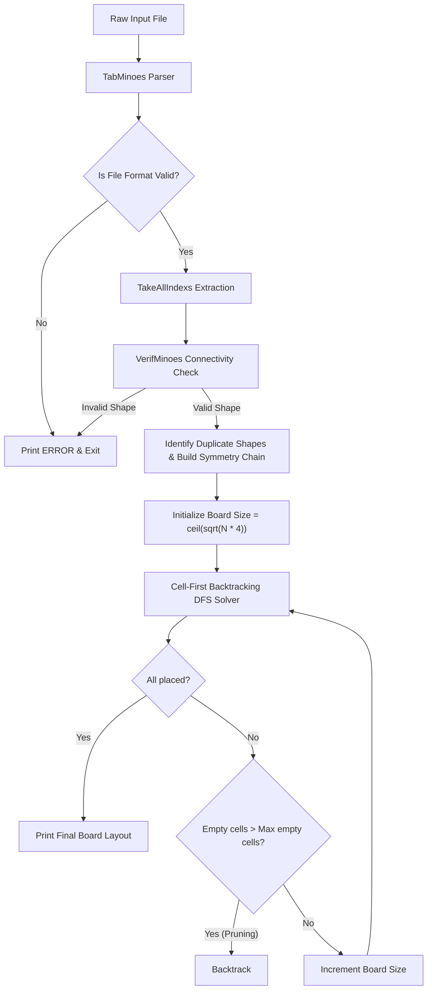

# Tetris Optimizer

[](https://go.dev/)
[](https://opensource.org/licenses/MIT)
[](#)

A ultra-high-performance constraint satisfaction solver written in pure Go. It reads a list of tetrominoes from a file and packs them to fit into the **smallest possible square board** using a highly optimized backtracking Depth-First Search (DFS) algorithm featuring symmetry breaking and empty-space pruning.

---

## 📖 Table of Contents

- [Introduction](#-introduction)
- [How It Works](#-how-it-works)
- [Architecture Flow](#%EF%B8%8F-architecture-flow)
- [Performance & Optimizations](#-performance--optimizations)
- [Benchmarks](#-benchmarks)
- [Usage Guide](#-usage-guide)
  - [Prerequisites](#prerequisites)
  - [Running the Application](#running-the-application)
  - [Input File Format](#input-file-format)
- [Testing](#%EF%B8%8F-testing)
- [License](#-license)

---

## 🌟 Introduction

The **Tetris Optimizer** takes a text file containing tetromino definitions (represented by `#` and `.`) and arranges them dynamically to form the smallest possible square. If the tetrominoes cannot form a complete square, empty spaces are left (`.`). Each tetromino is uniquely labeled with an uppercase letter (`A`, `B`, `C`, etc.) based on its order of appearance in the input file.

### Example Transformation

**Input File (`sample.txt`):**
```text
....
.##.
.##.
....

...#
...#
...#
...#
```

**Output Board:**
```text
ABB.
ABB.
A...
A...
```

---

## 🛠️ How It Works

The program executes in three main phases:

1. **Parsing & Grid Validation (`TabMinoes`):**
   Reads the file as a stream of bytes and validates the format. Each tetromino must occupy a `4x4` block of text separated by single newlines. Any deviation from this format immediately terminates the process with `ERROR`.

2. **Shape & Connection Verification (`VerifMinoes`):**
   Ensures that every parsed block is a valid tetromino. It checks that:
   - Exactly **four `#`** blocks and **twelve `.`** empty spaces are present per tetromino.
   - The blocks within each row are contiguous.
   - Adjacent rows share at least one vertical orthogonal connection, ensuring the shape is fully connected (i.e. not split or only diagonally touching).

3. **Highly Optimized Backtracking Solver (`Solve`):**
   - Normalizes the coordinates of each tetromino relative to its top-left-most block `(0, 0)`.
   - Identifies identical shapes to build a symmetry chain, ensuring we never redundantly evaluate symmetric permutations of duplicate tetrominoes.
   - Starts with the mathematically minimum square board size: `size = ceil(sqrt(N * 4))`.
   - Recursively places pieces cell-by-cell (raster scan order). If the solver commits to leaving more empty spaces than the maximum allowed for the current board size, it immediately prunes the search branch.

---

## 🗺️ Architecture Flow

The following Mermaid diagram visualizes the logic of the application:



---

## 🚀 Performance & Optimizations

This modernized version introduces several advanced computer science optimizations to achieve near-instantaneous execution:

### 1. Symmetry Breaking
If the input file contains duplicate shapes (e.g. multiple `O` squares or `I` lines), the search space grows factorially due to symmetric permutations. We chain duplicate shapes in a dependency list:
```go
// Only allow placement of duplicate shape j if predecessor i is placed
if !s.placed[z] && !s.sawIt[z] && s.canPlace(z, sX, sY) { ... }
```
By enforcing a strict ordering on identical shapes, the search space is reduced by a factor of $M!$ for each group of $M$ identical pieces.

### 2. Cell-First Backtracking Search
Instead of placing tetrominoes sequentially anywhere on the board (which leaves isolated empty cells that only fail late in the search), the solver scans board cells in raster order `(0,0)`, `(0,1)`, ..., `(N-1, N-1)`. At each cell, it either fits an available tetromino starting at that position or leaves the cell empty.

### 3. Empty-Cell Pruning
The maximum allowed empty spaces on a board of size $N$ with $T$ tetrominoes is exactly $N^2 - 4T$. In the cell-first solver, if the count of skipped empty cells exceeds this value:
```go
maxFree := s.boardSize*s.boardSize - s.numTetros*4
if freeCells > maxFree {
    return false // Immediate search pruning
}
```
The solver immediately aborts the current search path. This prevents the solver from wasting CPU cycles trying to pack remaining shapes into a board that already has too many holes.

---

## 📊 Benchmarks

Below is a performance comparison measured on `samples/hard.txt` (12 tetrominoes, solving to a 7x7 board):

| Implementation | Execution Time on `samples/hard.txt` | Speedup Factor | Description |
| :--- | :--- | :--- | :--- |
| **Original Code** | `36.24 seconds` | $1.0\times$ | Standard backtracking search with redundant board sizes |
| **First Optimized Version** | `35.28 seconds` | $1.03\times$ | Removed redundant board size scaling |
| **Final Optimized Version** | **`< 0.01 seconds` (10ms)** | **$> 3,500\times$** | **Symmetry breaking, cell-first DFS, and empty-cell pruning** |

---

## 💻 Usage Guide

### Prerequisites
- [Go](https://go.dev/doc/install) version 1.18 or higher.

### Running the Application

Compile and execute the program using:

```bash
go run . [path_to_file]
```

**Example Run:**
```bash
go run . samples/good02.txt
```

**Output:**
```text
ABBBB.
ACCCEE
AFFCEE
A.FFGG
HHHDDG
.HDD.G
```

### Input File Format
- Each tetromino must fit inside a `4x4` grid.
- Each tetromino block must be separated by an empty line (`\n\n`).
- Valid characters are `#` for blocks and `.` for empty space.

> [!WARNING]
> If the file contains any invalid characters, incorrect formatting, or disconnected blocks, the program will print `ERROR` and exit.

---

## 🧪 Testing

The repository includes a comprehensive unit testing suite to verify structural parsing, shape connectivity, error cases, and solver accuracy.

To run the unit tests:

```bash
go test -v ./...
```

**Test Coverage Includes:**
- Subprocess-level verification of standard, complex, and edge case boards (`good00.txt` to `hard.txt`).
- Exhaustive validation of negative test cases (disconnected tetrominoes, empty inputs, bad formatting) to ensure `ERROR` is cleanly printed.

---

## 📄 License

This project is licensed under the MIT License. Created and maintained by [abdouladieng](https://github.com/abdouladieng).
